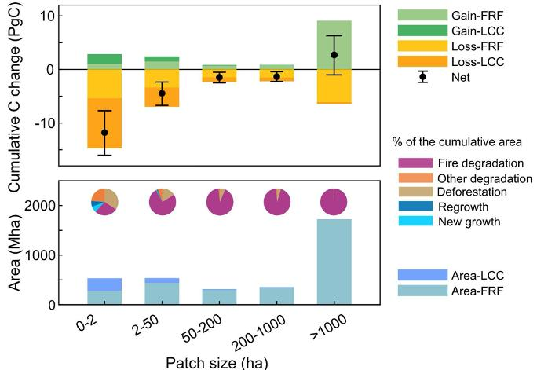

---
# Generated by scripts/sync_en.py; edit the Chinese source or translation cache.
title: Guojin He's team's global 30 m burned area product supports a Nature study
date: 2026-01-13
abstract: The long-term global 30 m burned area product GABAM provided key data for quantifying tropical forest carbon losses in a Nature paper.
summary: The long-term global 30 m burned area product (GABAM), developed by Guojin He's research team, provided key data for precise quantification of tropical forest carbon losses.
tags:
- Announcement
image:
  filename: W020260113582931496576.jpg
---

On January 7, Nature published the paper "Small persistent humid forest clearings drive tropical forest biomass losses" online. Using high-resolution forest disturbance and biomass data, the study constructed a grid-scale database of vegetation recovery following forest disturbances, then developed a forest carbon bookkeeping model integrating the database with high-resolution remote-sensing observations. The model was used to estimate spatial and temporal changes in vegetation carbon stocks caused by forest disturbances from 1990 to 2020, and to quantify the contributions of different disturbance types and patch sizes to changes in forest vegetation carbon stocks and carbon density. By introducing spatially explicit carbon recovery curves, the model overcomes the traditional reliance on regional response curves and substantially improves the representation of spatial heterogeneity and disturbance responses. The first author is Yidi Xu, a postdoctoral researcher at France's Laboratory for Climate and Environmental Sciences (LSCE). The co-corresponding authors are Wei Li, an associate professor in the Department of Earth System Science at Tsinghua University, and Philippe Ciais, a professor at LSCE. Guojin He, a researcher at the Aerospace Information Research Institute, Chinese Academy of Sciences, is a co-author.

The long-term global 30 m burned area product (GABAM), developed by Guojin He's research team, including Zhaoming Zhang and Tengfei Long, provided key supporting data. It enabled precise characterization of tropical forest fire disturbances over the past 30 years, particularly small burned patches, and helped quantify tropical forest carbon losses.

Since 2016, with support from projects under the National Key Research and Development Program of China and other programs, Guojin He's team has developed and shared the world's first and only global 30 m burned area product covering 1990–2024. It is currently the highest-resolution global burned area product. The work has produced 11 papers in journals including ISPRS Journal of Photogrammetry and Remote Sensing, Earth's Future, Geo-spatial Information Science, Photogrammetric Engineering & Remote Sensing, Remote Sensing, Remote Sensing Letters, and the Journal of Remote Sensing. The papers have been cited by Nature, Science, PNAS, and other leading journals; the most-cited individual paper has received 287 citations.

