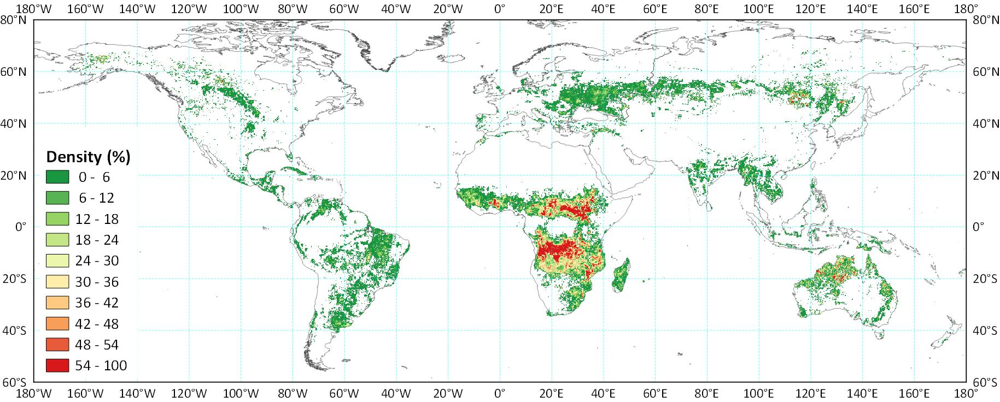
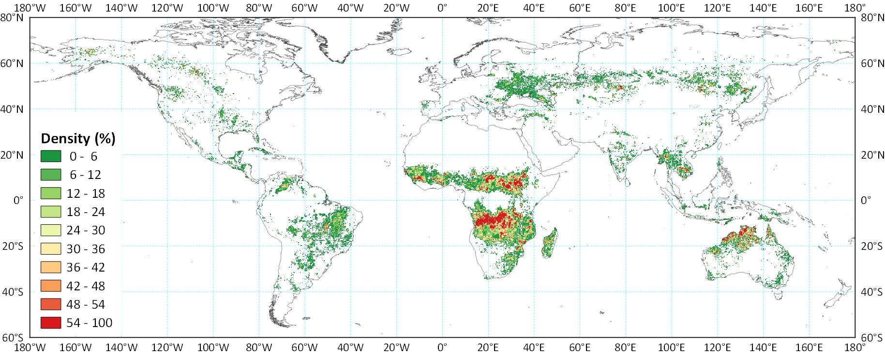
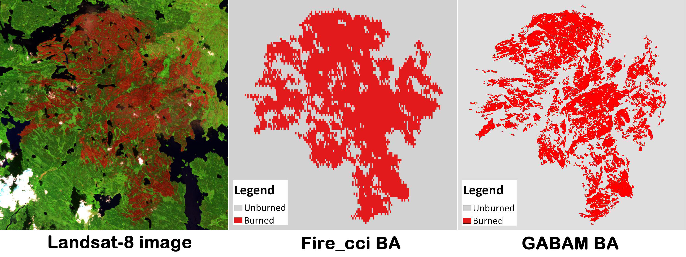

## 数据集描述

年度火烧迹地面积（Annual burned area）被定义为全年度内发生的火灾空间范围，不包括往年发生的火灾。

GABAM 数据集是基于 Google Earth Engine (GEE) 平台的自动化处理流水线，利用 GEE 上所有可用的 Landsat 卫星影像生成的。该产品采用地理坐标系（经纬度投影），分辨率为 0.00025&deg;（约 30 , with the WGS84 horizontal datum and the EGM96 vertical datum，使用 WGS84 水平基准和 EGM96 大地水准面。数据集由 10&deg;&times;10&deg;的分幅组成，覆盖范围为西经 180&deg;–东经180&deg; and 北纬80&deg;–南纬60&deg;。

下图展示了 GABAM 2015 全球火烧迹地面积（BA）密度的分布情况。火烧迹地面积密度定义为 0.25&deg;&times;0.25&deg;网格中被烧毁像素所占的比例。

<figure>
  
  <figcaption><em>GABAM 2015 火烧迹地面积（BA）密度分布</em></figcaption>
</figure>

以下是与近期发布的 Fire_cci 5.0 版[^footnote2] 全球 BA 产品（分辨率为 250 米，是 GABAM 发布前分辨率最高的全球产品）的对比：

<figure>
  
  <figcaption><em>Fire_cci 2015 火烧迹地面积（BA）密度分布</em></figcaption>
</figure>

## 下载方式

GABAM 数据集可从 [Zenodo](https://zenodo.org/records/13858799).

## 引用信息

如需使用该数据集，请引用以下论文：

    @article{Long_2019,
    doi = {10.3390/rs11050489},
    url = {https://doi.org/10.3390%2Frs11050489},
    year = 2019,
    month = {feb},
    publisher = {{MDPI} {AG}},
    volume = {11},
    number = {5},
    pages = {489},
    author = {Tengfei Long and Zhaoming Zhang and Guojin He and Weili Jiao and Chao Tang and Bingfang Wu and Xiaomei Zhang and Guizhou Wang and Ranyu Yin},
    title = {30 m Resolution Global Annual Burned Area Mapping Based on Landsat Images and Google Earth Engine},
    journal = {Remote Sensing}
    }

- [Long, T.; Zhang, Z.; He, G.; Jiao, W.; Tang, C.; Wu, B.; Zhang, X.; Wang, G.; Yin, R. 30 m Resolution Global Annual Burned Area Mapping Based on Landsat Images and Google Earth Engine. Remote Sens. 2019, 11, 489.](https://www.mdpi.com/2072-4292/11/5/489)

Please feel free to contact us (<longtf@radi.ac.cn>), feedback is welcome! 

[^footnote]: This research has been supported by The National Key Research and Development Program of China (2016YFA0600302 and 2016YFB0501502).
[^footnote2]: Chuvieco, E., Lizundia-Loiola, J., Pettinari, M.L., Ramo, R., Padilla, M., Tansey, K., Mouillot, F., Laurent, P., Storm, T., Heil, A., & Plummer, S. (2018). Generation and analysis of a new global burned area product based on MODIS 250 m reflectance bands and thermal anomalies. Earth Systems Science Data, 10, 2015-2031.
